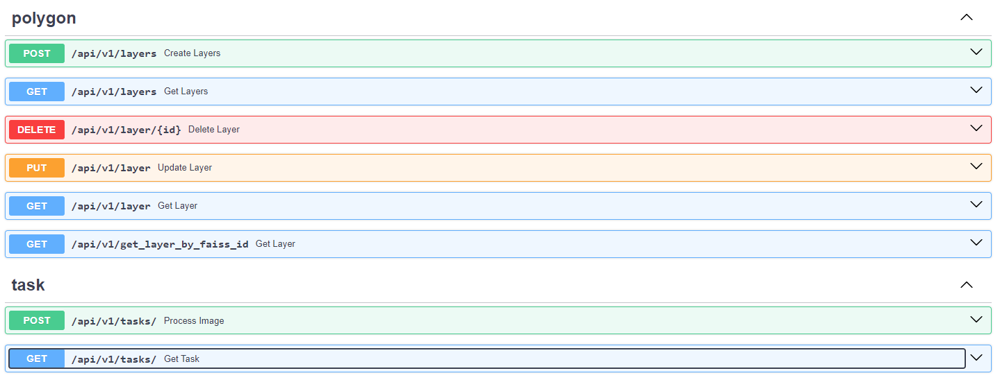
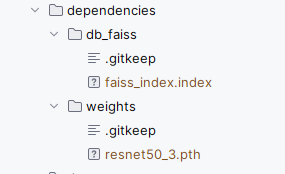

# 1. Описание

Данный репозиторий содержит код сервера для задачи 18 "Алгоритм эффектиной обработки спутниковых снимков российской орбитальной группировки"

Данный репозиторий реализует основную логику определения координат загружаемого снимка.

## Описание методов API

API реализует методы для загрузки/удаления/изменения/получения подложек (layers), в частности получение по faiss_id

Для поиска координат передаваемого изображения на подложке используется POST запрос `/api/v1/tasks/` 
в который передается layout_name и файл изображения, для которого будет производится поиск координат на подложке.
В результате метод возвращает ` {‘task_id’: <назначенный_id>}`, где `task_id` идентификатор задачи, 
по которому можно получить результат поиска координат для переданного ранее снимка. 

Для этого необходимо воспользоваться `GET` запросом `/api/v1/tasks/` в параметр `id` которого необходимо 
передать полученный ранее `task_id`. В результате выполнения запроса будет возвращена следующая информация в виде json:

```commandline
«layout_name» имя подложки,
«crop_name» имя снимка,  
«ul», «ur», «br», «bl», где лево-верх, право-верх, право-низ, лево-низ координаты, 
«crs» координатная система в формате «EPSG:{12345}», 
«start» и «end» время в формате «%Y-%m-%dT%h:%m:%s» начала и окончания обработки единичного загруженного снимка
```

Все методы API:





# 2. Запуск

Запуск приложения осуществляется в 2 этапа. Это необходимо для загрузки необходимой метаинформации о подложках и 
создания индекса FAISS. 

Первый этап обуславливается запуском приложения без индекса FAISS.

Второй этап подразумевает подгрузку индекса и перезапуск приложения. 
Это уже полноценный запуск приложения, если вы ранее сделали первый этап и не очищали базу данных то пользуйтесь этим руководством

## 2.1 Предварительная подготовка

Перед началом запуска приложения необходимо загрузить веса модели, расположенные по 
[ссылке](https://disk.yandex.ru/d/UzcSbTGY9nNOSA) и положить их в каталог `/dependencies/weights`.

## 2.2 Конфигурирование проекта

Перед запуском сервера необходимо в корневой дирректории скопировать файл `.env_example` 
и переиновать его в `.env` с помощью этого файла будет осуществляться конфигурирование проекта.

_(Для удобства все необходимые переменные уже забиты в `.env_example`)_

Структура файла:

- `POSTGRES_USER` --- Имя пользователя (По умолчанию postgres)
- `POSTGRES_PASSWORD` --- Пароль базы данных (По умолчанию postgres)
- `POSTGRES_DB` --- Имя базы данных (По умолчанию postgres)
- `DATABASE_URI` --- URI адрес базы данных в формате <HOST>:<PORT> (По умолчанию aerial-photography-db (локальная сеть докера)) 
- `DATABASE_PORT` --- Порт, на котором будет развернута база данных (По умолчанию 5432)
- `BACKEND_PORT` --- Порт, на котором будет развернуто приложение (По умолчанию 8000)
- `PATH_TO_WEIGHTS_VECTORIZER` --- Путь до загружаемых весом модели (По умолчанию '/dependencies/weights/resnet50_3.pth')
- `PATH_TO_FAISS_INDEX` --- Путь до загружаемого индекса FAISS  (По умолчанию '/dependencies/db_faiss')


## 2.3 Первый этап

В данном пункте содержится руководство по запуску приложения в первом этапе. На данном этапе у вас уже должны быть 
загружены предварительно обученные веса (см. п. "Предварительная подготовка") и все конфигурационные параметры указаны верно
(см. п. "Конфигурирование проекта"").

Далее необходимо выполнить запуск приложения.

### 2.3.1 Запуск приложения

#### 2.3.1.1 Запуск приложения в Docker

Перед запуском контейнера необходимо создать сеть
```
docker network create network-aerial-photography
```

Далее необходимо запустить приложение, выполнив команду
```
docker-compose --env-file .env up --build
```
Далее необходимо склонировать репозиторий (ссылка на репозиторий DTL-data-processing)[https://github.com/betepok506/DTL-data-processing] 
и выполнить все необходимые инструкции по установке там (см. п. 3.3 Векторизация изображений подложки и загрузка в БД)


#### 2.3.1.2 Запуск приложения локально

Для локального запуска необходимо установить все зависимости, выполнив команду:

```commandline
pip install -r requirements.txt
```

Далее необходимо правильно импортировать все переменные окружения, заданные в файле `.env`, 
но уже с параметрами и путями до файлов конкретно в вашей системе. 

**Всю ответственность по настройке приложения локально вы возлагаете на себя**


## 2.4 Второй этап

Далее останавливаем docker контейнер и копируем `faiss_index.index` из репозитория (DTL-data-processing)[https://github.com/betepok506/DTL-data-processing]  
 в каталог `/dependencies/db_faiss`.

В результате должно получится вот так



## 2.5 Непостредственный запуск

Запускаем docker контейнер командой:
```
docker-compose --env-file .env up --build
```